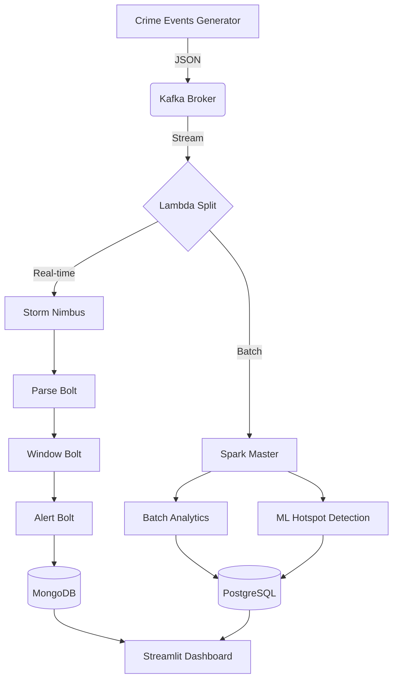

# Enterprise Crime Analytics Framework
## A Big Data Lambda Architecture Implementation

This repository contains a scalable, real-time crime analytics platform built on a **Lambda Architecture**. The system is designed to ingest high-velocity crime event streams and provide both sub-second alerting and deep historical analysis.

---

## 🏗️ System Architecture

The project follows the **Lambda Architecture** pattern, splitting data into Speed and Batch layers for optimal performance.



### Core Components:
*   **Ingestion**: Apache Kafka (Durable messaging).
*   **Speed Layer**: Apache Storm (Flux topology for sliding-window anomaly detection).
*   **Batch Layer**: Apache Spark (Analytical aggregations and K-Means clustering).
*   **Serving Layer**: Hybrid storage using PostgreSQL (Structured) and MongoDB (Unstructured).
*   **Visualization**: Streamlit (Interactive dashboard with maps and time-series trends).

---

## 🚀 Quick Start

### 1. Prerequisites
*   Docker & Docker Compose
*   Python 3.x (for local producer)

### 2. Deploy Infrastructure
```bash
docker compose -f docker/docker-compose.yml up -d
```

### 3. Run Analytics (Spark)
```bash
# Historical Batch Analytics
docker exec -it docker-spark-master-1 spark-submit --packages org.postgresql:postgresql:42.7.1 /app/spark/analytics/batch_analytics.py

# ML Hotspot Detection
docker exec -it docker-spark-master-1 spark-submit --packages org.postgresql:postgresql:42.7.1 /app/spark/ml/hotspot_detection.py
```

### 4. Start Real-time Ingestion
```bash
python kafka/producer.py
```

### 5. Access Dashboard
Open [http://localhost:8501](http://localhost:8501) in your browser.

---

## 📈 Methodology & ML
The system utilizes **K-Means Clustering** via Spark MLlib to identify geographic centroids of crime activity ("hotspots"). The real-time layer uses **sliding windows** in Storm to detect statistically significant spikes in district-level crime frequency, triggering immediate alerts in the dashboard.

---

## 👤 Author
**Haider Rizwan**  
Roll Number: 22i-2379  

---
*Note: This project was developed as a solo submission for the Big Data Analytics course.*
